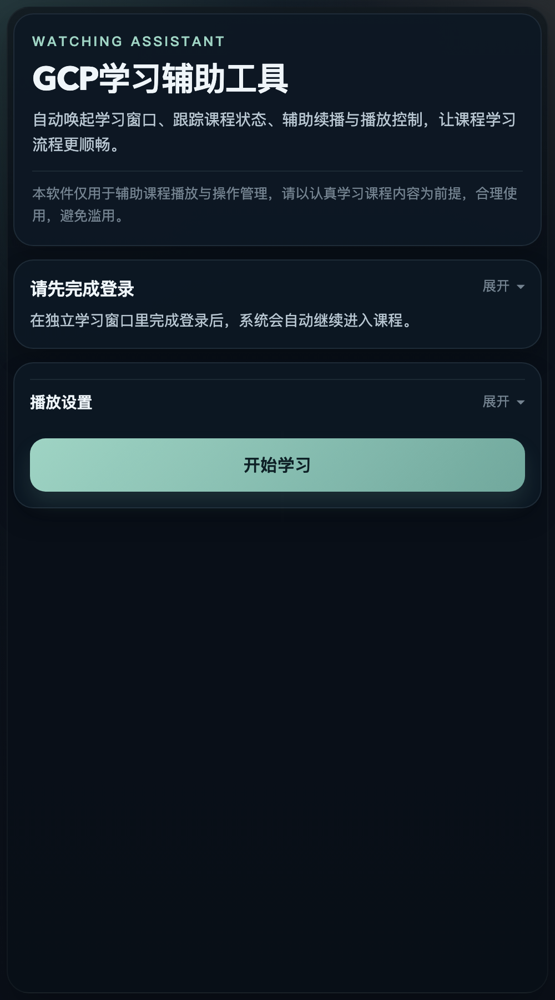

# GCPLearning

GCP学习辅助工具是一个基于 Electron、React 和 TypeScript 构建的桌面应用，用于辅助网络课程学习流程。  
它会在独立学习窗口中打开课程页面，帮助用户完成学习窗口唤起、课程状态识别、播放控制、进度续播和自动推进等操作。

> 本软件仅用于辅助课程播放与操作管理，请以认真学习课程内容为前提，合理使用，避免滥用。

## 主界面预览



## 当前功能

- 独立学习窗口播放课程页面，避免主控界面挤压播放区域
- 自动检测登录状态，并在需要时提示用户先完成登录
- 自动进入课程、识别播放页并监控学习状态
- 支持暂停学习、继续学习、自动推进下一节
- 支持播放页自动静音
- 支持根据观看轨迹恢复到历史学习断点附近继续播放
- 本地保存登录相关 cookie，尽量复用上一次登录状态

## 技术栈

- Electron
- React
- TypeScript
- electron-vite

## 本地开发

先安装依赖：

```bash
npm install
```

启动开发模式：

```bash
npm run dev
```

启动生产预览：

```bash
npm run preview
```

构建应用资源：

```bash
npm run build
```

## 项目结构

```text
.
├── electron
│   ├── main          # Electron 主进程逻辑
│   └── preload       # 预加载脚本 / IPC 桥接
├── shared            # 主进程与前端共享类型和逻辑
├── src               # React 主控界面
├── docs/images       # README 配图等资源
└── out               # 构建输出目录
```

## 使用说明

1. 打开主控界面后，点击“开始学习”
2. 程序会自动唤起独立学习窗口
3. 如果当前未登录，请先在学习窗口中完成登录
4. 登录成功后，程序会继续自动进入课程并辅助播放

## 说明与提醒

- 登录状态和播放相关数据仅保存在本机本地目录中
- 应用当前以辅助学习流程为目标，不建议脱离真实学习场景使用
- 后续可以继续接入安装包打包、自动更新和 GitHub Actions 发布流程
